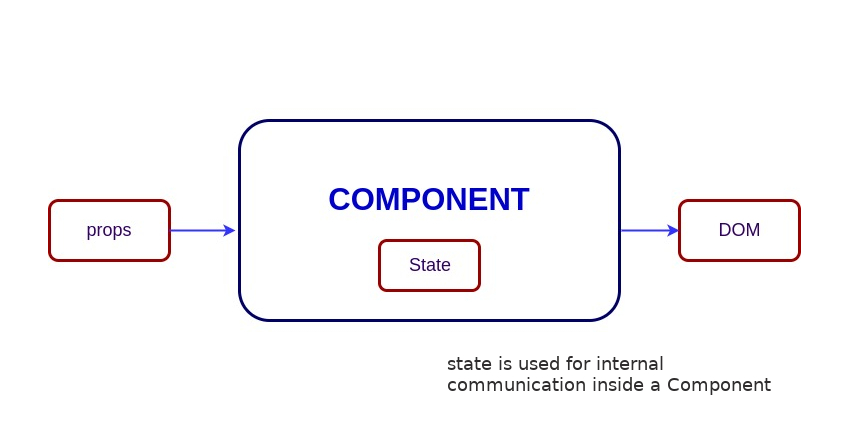

# React interjú kérdések

### Tartalomjegyzék

| No. | Questions                                                                                                                                                      |
| --- | -------------------------------------------------------------------------------------------------------------------------------------------------------------- |
|     | **Core React**                                                                                                                                                 |
| 1   | [Mi a React?](#mi-a-react)                                                                                                                                     |
| 2   | [Mik a React legfőbb tulajdonságai?](#mik-a-react-legfőbb-tulajdonságai)                                                                                       |
| 3   | [Mi a JSX?](#mi-a-jsx)                                                                                                                                         |
| 4   | [Mi a különbség az Element és a Component között?](#mi-a-különbség-az-element-és-a-component-között)                                                           |
| 5   | [Hogyan csinálunk Reactban komponenseket?](#hogyan-csinálunk-reactban-komponenseket)                                                                           |
| 6   | [Mikor használjunk Osztály alapú komponenseket és mikor Függvénykomponenseket?](#mikor-használjunk-osztály-alapú-komponenseket-és-mikor-függvénykomponenseket) |
| 7   | [Mik a Tiszta Komponensek (Pure Components)?](#what-are-pure-components)                                                                                       |
| 8   | [Mi a State a Reactban?](#mi-a-state-a-reactban)                                                                                                               |
| 9   | [Mik a propok?](#mik-a-propok)                                                                                                                                 |
| 10  | [Mi a különbség a State és a Props között?](#mi-a-különbség-a-state-és-a-props-között)                                                                         |
| 11  | [Miért ne módosítsuk a state-t közvetlenül?](#miért-ne-módosítsuk-a-state-t-közvetlenül)                                                                       |
| 12  | [Mi a jelentősége egy callback függvénynek a `setState()` argumentumaként?](#mi-a-jelentősége-egy-callback-függvénynek-a-setstate-argumentumaként)             |
| 13  | [Mi a különbség a React és a HTML eseménykezelés között?](#mi-a-különbség-a-react-és-a-html-eseménykezelés-között)                                             |

1. ### Mi a React?
   A React egy **nyílt forráskódú frontend JavaScript könyvtár** amit frontend, legfőképp single page appok (SPA-k) fejlesztésére használnak. A React-et [Jordan Walke](https://github.com/jordwalke) találta ki, egy fejlesztő a Facebooknál. Az első alkalmazás ami Reactben készült az a Facebook híroldala (2011) és az Instagram (2012)
   **[⬆ Back to Top](#tartalomjegyzék)**
2. ### Mik a React legfőbb tulajdonságai?

   A legfőbb tulajdonságok:

   - **VirtualDOM**-ot használ a valódi DOM helyett, mert a valódi DOM-on végrehajtott műveletek drágák.
   - Támogatja a szerveroldali renderelést (**server-side rendering**).
   - Egyirányú (**Unidirectional**) adatfolyást követ.
   - Újrafelhasználható (**Reusable/Composable**) komponenseket készíthetünk vele.

   **[⬆ Back to Top](#tartalomjegyzék)**

3. ### Mi a JSX?

   A JSX egy XML-hez hasonló szintaktikai kiegészítés az ECMAScripthez (JSX = JavaScript XML). Tulajdonképpen szintaktikai cukorkát ad a `React.createElement()` függvényhez, tehát kapunk egy egyszerű HTML-szerű szintaxist a JavaScript erejével párosítva.

   A következő példában a `<h1>` tag visszatérül a render függvényben.

   ```jsx harmony
   class App extends React.Component {
     render() {
       return (
         <div>
           <h1>{"Welcome to React world!"}</h1>
         </div>
       );
     }
   }
   ```

**[⬆ Back to Top](#tartalomjegyzék)**

4. ### Mi a különbség az Element és a Component között?

   Az Element egy szimpla objektum, ami leírja mit akarunk látni a képernyőn DOM csomópontok vagy React komponensek által. Az Elementek tartalmazhatnak több Elementet a propjaikban. Egy React element kreálása nem memóriaigényes folyamat. Ha egy element létrejön, az már nem változtatható.

   Az objektumos reprezentációja egy React Elemetnek:

   ```javascript
   const element = React.createElement("div", { id: "login-btn" }, "Login");
   ```

   A fenti `React.createElement()` függvény visszaad egy objektumot:

   ```
   {
     type: 'div',
     props: {
       children: 'Login',
       id: 'login-btn'
     }
   }
   ```

   És végül renderelődik a DOM-ban a `ReactDOM.render()` által:

   ```html
   <div id="login-btn">Login</div>
   ```

   Azonban egy Component deklarálható sok különféle módon. Lehet egy Class a `render()` metódussal. Egyszerűbb esetekben lehet egy függvény is. Mindkét esetben elfogad propokat inputként, és visszatérül egy JSX fával outputként:

   ```javascript
   const Button = ({ onLogin }) => (
     <div id={"login-btn"} onClick={onLogin}>
       Login
     </div>
   );
   ```

   Ezután a JSX transpileolva lesz egy `React.createElement()` függvény fává:

   ```javascript
   const Button = ({ onLogin }) =>
     React.createElement("div", { id: "login-btn", onClick: onLogin }, "Login");
   ```

   **[⬆ Back to Top](#tartalomjegyzék)**

5. ### Hogyan csinálunk Reactban komponenseket?

   Két módja van a komponensek készítésének.

   1. **Function Component:** Ez a legegyszerűbb módja egy React komponens készítésének. Ezek tiszta JS függvények, amik props onjektumot várnak paraméterül, és React elementeket adnak vissza:

      ```jsx harmony
      function Greeting({ message }) {
        return <h1>{`Hello, ${message}`}</h1>;
      }
      ```

   2. **Class Components:** Használhatunk ES6 class szintaxist is komponensek készítésére. A fenti példa class módszerrel:

      ```jsx harmony
      class Greeting extends React.Component {
        render() {
          return <h1>{`Hello, ${this.props.message}`}</h1>;
        }
      }
      ```

**[⬆ Back to Top](#tartalomjegyzék)**

6. ### Mikor használjunk Osztály alapú komponenseket és mikor Függvénykomponenseket?

   Ha a komponensnek szüksége van **state-re vagy lifecycle metódusokra** akkor class komponenseket használjunk, másképp megteszi a függvénykomponens is.
   _Azonban, a React 16.8-as verziójától kezdve (Hook frissítés) használhatunk statet és lifecycle metódusokat függvénykomponensekben is. Tehát végsősoron preferencia kérdése._

**[⬆ Back to Top](#tartalomjegyzék)**

7. ### What are Pure Components?

   React.PureComponent az ugyanaz mint a React.Component, annyi különbséggel, hogy a `shouldComponentUpdate()` metódust kezeli helyetted. Ha a propok vagy a state változik a PureComponent csinál egy shallow összehasonlítást mindkettőn. A Component azoknak nem ellenőriz automatikusan.

   **[⬆ Back to Top](#tartalomjegyzék)**

8. ### Mi a State a Reactban?

   Egy komponens state-je egy objektumot rejt, ami olyan információt tartalmaz, ami a komponens élettartama során változni fog. A state-ünket mindig minél rövidebbre és egyszerűbbre ajánlott tervezni, és minimalizálni az előfordulását is. Tehát ha lehet használjunk minél kevesebb stateful komponenst.

   Csináljunk egy User komponenst egy message state-tel:


    ```jsx harmony
    class User extends React.Component {
      constructor(props) {
        super(props)

        this.state = {
          message: 'Welcome to React world'
        }
      }

      render() {
        return (
          <div>
            <h1>{this.state.message}</h1>
          </div>
        )
      }
    }
    ```

    

    A state hasonlít a propshoz, de privát és teljes mértékben a komponens módosítja és kezeli. Pl nem érheti el egy másik komponens, kivéve akkor, ha mi ezt explicit akarjuk.

**[⬆ Back to Top](#tartalomjegyzék)**

9. ### Mik a propok?

   A propok inputok egy adott komponenshez. Ezek szimpla értékek vagy objektumok, amik tartalmaznak értékeket, amiket átadunk a komponensünknek, egy olyan elnevezési konvenciót használva, amit a HTML-nél megszokhattunk. Tehát a propok adatok, amiket egy szülőkimponens átad a gyerekkomponenseknek.

   Az első számú szerepei a propoknak a Reactban:

   1. Adat átadása komponenseknek.
   2. State változások gerjesztése.
   3. Használható a `this.props.[prop neve]` módon a render metódusban

   Pl csináljunk egy elemet egy `reactProp` nevű proppal:

   ```jsx harmony
   <Element reactProp={"1"} />
   ```

   Ez a reactProp (lehet a neve bármi más) a React komponens egyik adattagja lesz, amit bármikor használni tudunk.

   ```
   props.reactProp
   ```

**[⬆ Back to Top](#tartalomjegyzék)**

10. ### Mi a különbség a state és a props között?

    A state és a props is JS objektumok. Mindkettő információt tárol, ami befolyásolja a komponensünk működését. Azonban a működésük és a céljuk teljesen eltér: a propok át vannak adva komponensünknek (mintha egy függvénynek paramétereket adnánk meg), a state pedig a komponens belsejében létrehozott, és változtatott érték (mintha egy függvényben változókat hoznánk létre)

**[⬆ Vissza a tetejére](#tartalomjegyzék)**

12. ### Miért ne módosítsuk a state-t közvetlenül?

    Ha direkt változtatjuk a state-t, akkor nem renderelődik újra a komponens

    ```javascript
    //Wrong
    this.state.message = "Hello world";
    ```

    Helyette használjuk a `setState()` metódust. Ez elrendezi a komponensünk újrarenderelését, amint változtatunk az állapotán. Ha változik a state - a komponens válaszul újra renderelődik.

    ```javascript
    //Correct
    this.setState({ message: "Hello World" });
    ```

    **Megjegyzés:** Direkt megadhatjuk a state-t a konstruktorban vagy használhatjuk a JS class-field deklarációs szintaxisát.

**[⬆ Back to Top](#tartalomjegyzék)**

13. ### Mi a jelentősége egy callback függvénynek a `setState()` argumentumaként?

    The callback function is invoked when setState finished and the component gets rendered. Since `setState()` is **asynchronous** the callback function is used for any post action.
    A callback függvény meghívásra kerül, ha a setState befejeződik, és a komponens renderelődik. Mivel a setState aszinkronos, a callback függvény minden **post** action-re használva van

    **Megjegyzés:** ajánlott lifecycle metódust használni callback fg helyett.

    ```javascript
    setState({ name: "John" }, () =>
      console.log("The name has updated and component re-rendered")
    );
    ```

    **[⬆ Vissza a tetejére](#tartalomjegyzék)**

14. ### Mi a különbség a React és a HTML eseménykezelés között?

    1. HTML-ben az esemény neve **kis betűvel** írandó:

       ```html
       <button onclick="activateLasers()"></button>
       ```

       A Reactban azonban **camelCase** használandó:

       ```jsx harmony
       <button onClick={activateLasers}>
       ```

    2. HTML-ben returnölhetünk false értéketm hogy megelőzzük az alapértelmezett viselkedést:

       ```html
       <a
         href="#"
         onclick='console.log("The link was clicked."); return false;'
       />
       ```

       A Reactban azonban explicit meg kell hívni a`preventDefault()` metódust:

       ```javascript
       function handleClick(event) {
         event.preventDefault();
         console.log("The link was clicked.");
       }
       ```

    3. A HTML-ben a fg végére oda kell tenni a `()` zárójeleket.
       A Reactban azonban nem szabad ezt odarakni, mert a rendereléskor automatikusan meg fog hívódni a függvény.
